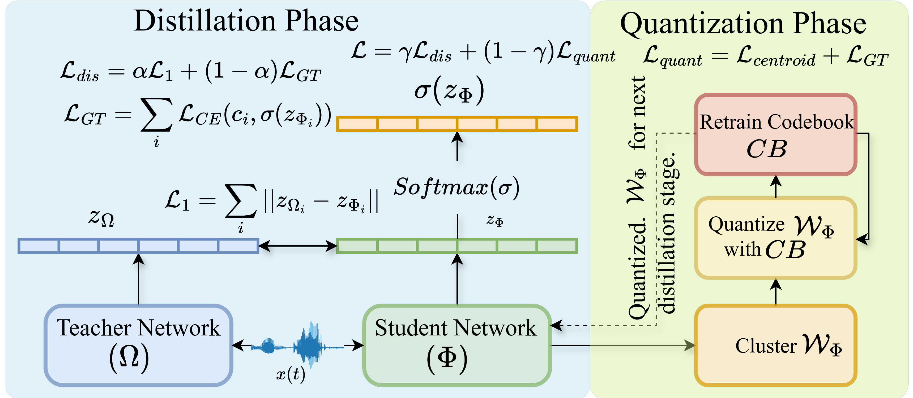
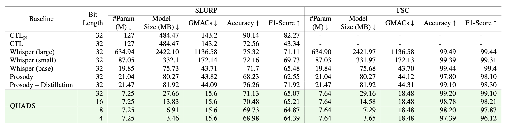

<p></p>

<h1 align="center">
    <a href="https://arxiv.org/abs/2505.14723" style="color:#825987">
        QUADS: QUAntized Distillation Framework for Efficient Speech Language Understanding
    </a>
</h1>



## 🚀 Main Results
**Comparison of QUADS and Prior Methods on the SLURP and FSC Datasets.** We report accuracy and F1-score for model performance, alongside GMACs and model size, to evaluate efficiency.


## 🛠️ Requirements and Installation
```bash
git clone https://github.com/BASHLab/QUADS.git
cd QUADS
pythom3 -m venv venv
source venv/bin/activate
pip install -r requirements.txt
```

## 🗝️ Training & Evaluation
```bash
python train.py
```

## Citation
```
@article{biswas2025quads,
  title={QUADS: QUAntized Distillation Framework for Efficient Speech Language Understanding},
  author={Biswas, Subrata and Khan, Mohammad Nur Hossain and Islam, Bashima},
  journal={arXiv preprint arXiv:2505.14723},
  year={2025}
}
```
